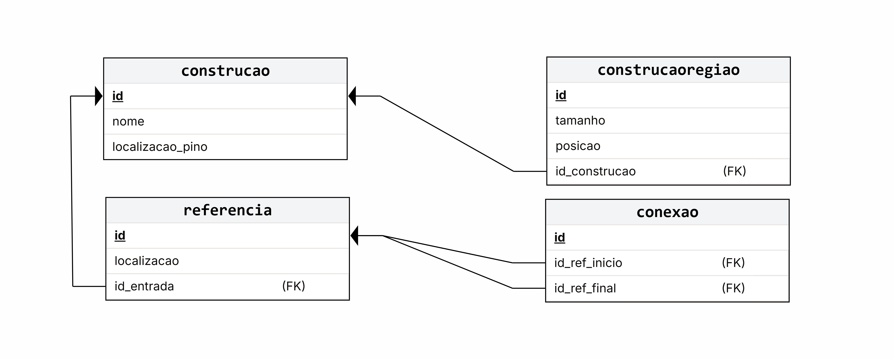

# Modelo de Dados

## Histórico de Revisões

| Data | Versão | Descrição | Autores |
| :--: | :----: | :-------: | :-----: |
| 23/08/2026 | 1.0 | Versão inicial | Gabriel Isaias |

## 1. Diagrama ER

> Substitua pela imagem do Diagrama ER...

[LINK para o arquivo com o modelo](#)

## 2. Modelo Relacional

## 3. Dicionário de Dados

--- 
**Tabela** : construcao

*Descrição* : Uma construção armazena todas as áreas que a compõe, além de um pino para ela seja localizada no mapa

*Observações* : Nenhuma observação

| Colunas | Descrição | Tipo de Dado | Tamanho | Null | PK | FK | Unique | Identity | Default | Check | 
| ------- | --------- | ------------ | ------- | ---- | -- | -- | ------ | -------- | ------- | ----- |
| id | Chave primária | INT | 2 bytes | &#9744;  | &#9745; | &#9744; | &#9745; | AUTOINCREMENT |  |  | 
| nome | Nome da construção | VARCHAR | 50 bytes | &#9744;  | &#9744; | &#9744; | &#9744; |  |  |  | 
| localizacao_pino | Coordenadas do pino | VARCHAR | 50 bytes | &#9744;  | &#9744; | &#9744; | &#9745; |  | [0, 0] |  | 

--- 
**Tabela** : construcaoregiao

*Descrição* : Área que compõe os limites de uma construção

*Observações* : É definida como uma AABB (Axis Aligned Bounding Box)

| Colunas | Descrição | Tipo de Dado | Tamanho | Null | PK | FK | Unique | Identity | Default | Check | 
| ------- | --------- | ------------ | ------- | ---- | -- | -- | ------ | -------- | ------- | ----- |
| id | Chave primária | INT | 2 bytes | &#9744;  | &#9745; | &#9744; | &#9745; | AUTOINCREMENT |  |  | 
| tamanho | Coordenadas da região | VARCHAR | 50 bytes | &#9744;  | &#9744; | &#9744; | &#9744; |  | [0, 0] |  |
| posicao | Largura e altura da região | VARCHAR | 50 bytes | &#9744;  | &#9744; | &#9744; | &#9744; |  | [0, 0] |  |
| id_construcao | Construção de referência | INT | 2 bytes | &#9744;  | &#9744; | &#9745; | &#9744; |  |  |  | 

--- 
**Tabela** : referencia

*Descrição* : Ponto no mapa

*Observações* : Nenhuma observação

| Colunas | Descrição | Tipo de Dado | Tamanho | Null | PK | FK | Unique | Identity | Default | Check | 
| ------- | --------- | ------------ | ------- | ---- | -- | -- | ------ | -------- | ------- | ----- |
| id | Chave primária | INT | 2 bytes | &#9744;  | &#9745; | &#9744; | &#9745; | AUTOINCREMENT |  |  | 
| localizacao | Coordenadas do ponto | VARCHAR | 50 bytes | &#9744;  | &#9744; | &#9744; | &#9745; |  | [0, 0] |  |
| id_entrada | Construção de referência | INT | 2 bytes | &#9745;  | &#9744; | &#9745; | &#9744; |  |  |  | 

--- 
**Tabela** : conexao

*Descrição* : Aresta conectando duas referências do mapa

*Observações* : Não define uma rota.

| Colunas | Descrição | Tipo de Dado | Tamanho | Null | PK | FK | Unique | Identity | Default | Check | 
| ------- | --------- | ------------ | ------- | ---- | -- | -- | ------ | -------- | ------- | ----- |
| id | Chave primária | INT | 2 bytes | &#9744;  | &#9745; | &#9744; | &#9745; | AUTOINCREMENT |  |  | 
| id_ref_inicio | Referência de início | INT | 2 bytes | &#9744;  | &#9744; | &#9745; | &#9744; |  |  |  | 
| id_ref_final | Referência final | INT | 2 bytes | &#9744;  | &#9744; | &#9745; | &#9744; |  |  |  | 