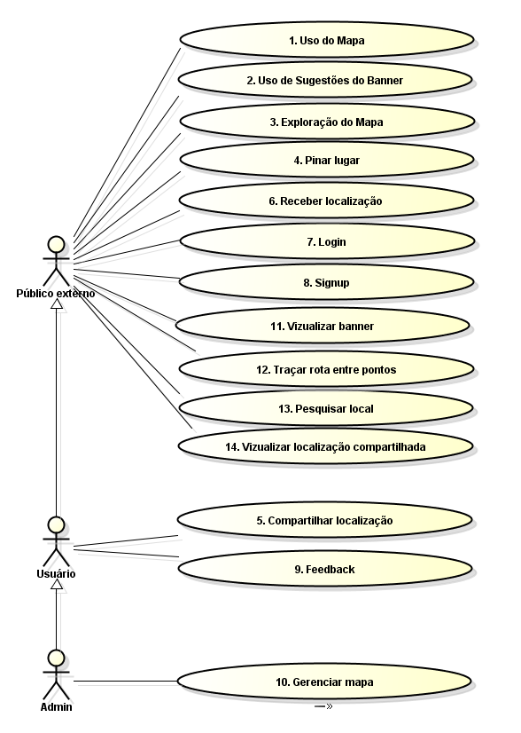

# Modelo de Casos de Uso

## Histórico de Revisões

| Data | Versão | Descrição | Autores |
| :--: | :----: | :-------: | :-----: |
| 03/04/2026 | 1.0 | Versão inicial | Gabriel Isaias |

## 1. Diagrama de Casos de Uso

[LINK para o arquivo Astah com o modelo](/doc/arquivo_astah/mapa_cnat_cdu.asta)

## 2. Listagem dos Detalhamentos dos Casos de Uso

1. [CDU 01 - Uso do Mapa :white_check_mark:](cdu_01/README.md)
2. [CDU 02 - Uso de Sugestões do Banner :white_check_mark:](cdu_02/README.md)
3. [CDU 03 - Exploração do Mapa :white_check_mark:](cdu_03/README.md)
4. [CDU 04 - Pinar Lugar :white_check_mark:](cdu_04/README.md)
5. [CDU 05 - Uso de Sugestões do Banner :white_check_mark:](cdu_05/README.md)
6. [CDU 06 - Receber localização :white_check_mark:](cdu_06/README.md)
7. [CDU 07 - Login :white_check_mark:](cdu_07/README.md)
8. [CDU 08 - Signup :white_check_mark:](cdu_08/README.md)
9. [CDU 09 - Relatar Feedback :white_check_mark:](cdu_09/README.md)
