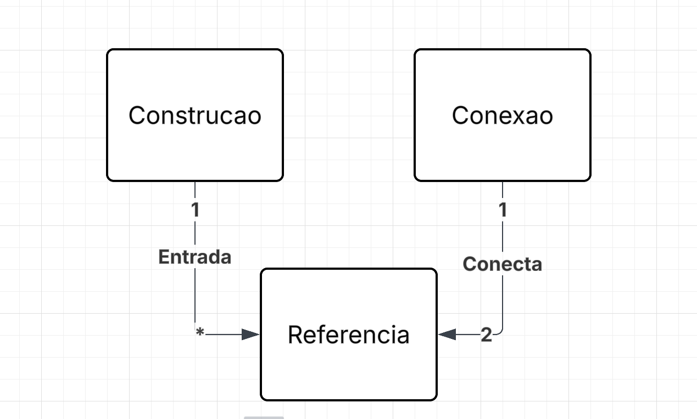

# Modelo de Domínio

## Histórico de Revisões

| Data | Versão | Descrição | Autores |
| :--: | :----: | :-------: | :-----: |
| 23/08/2026 | 1.0 | Versão inicial | Gabriel Isaias |

## 1. Diagrama das Classes Conceituais do Domínio

## 2. Glossário (sugestão)

| Termo | Explicação |
| :---: | :--------: |
| Entrada | Define um ponto de entrada ou saída para uma construção |
| Conecta | Informa que uma conexão faz a ponte entre dois pontos de referência, representando uma parte de um trajeto. OBS.: A conexão é uma parte primitiva de uma rota maior. Atua de forma análoga a uma aresta de um grafo |
| Construcao | Delimitação em uma camada lógica de uma região do mapa |
| Conexao | Primitivo para uma rota. Representa uma linha reta entre dois pontos de referência |
| Referencia | Um ponto genérico no mapa. |